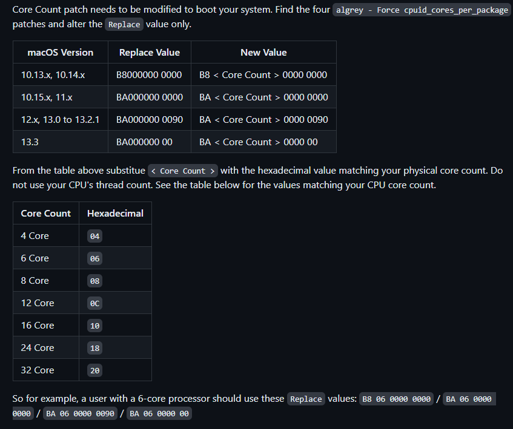
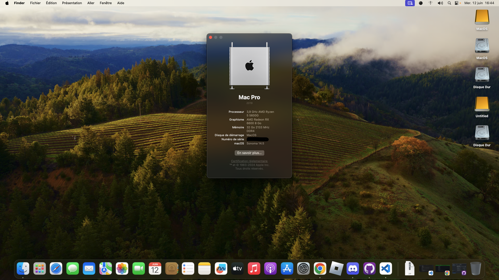

# Aorus-B550M-Elite-Hackintosh

Prebuilt opencore EFI for macos

## Specifications

| Specifications      | Detail                                      |
| ------------------- | ------------------------------------------- |
| Motherboard         | Gigabyte Aorus B500M Elite                  |
| CPU                 | AMD Ryzen 5 5600G                           |
| Memory              | 32GB Ram (4x8GB) Corsair Vengences DDR4     |
| SSD                 | Emtec 250GB SDD                             |
| Integrated Graphics | AMD Radeon RX Vega 7 (disabled)             |
| GPU                 | AMD Radeon RX 6600 8GB                      |
| Sound Card          | ALC887                                      |
| Wireless Card       | /                                           |
| Ethernet/LAN        | Realtek® GbE LAN chip                       |

# Supported Version of macos
| MacOS version       | Link                                        |
| ------------------- | ------------------------------------------- |
| Tahoe 26            |  Soon                 |
| Sequoia 15          |  Soon                 |
| Sonoma 14           |  [EFI](https://github.com/GeantW0rld/Aorus-B550M-Elite-Hackintosh/tree/main/Sonoma)                |
| Ventura 13          |  Not supported by this EFI                 |
| Monterey 12         |  Not supported by this EFI                 |
| Big Sur 11          |  Not supported by this EFI                 |

# Configurations
- change to `Kernel -> Patch` the number of core [more info here](https://dortania.github.io/OpenCore-Install-Guide/AMD/zen.html#patch-2)

- change SMBIOS (recommended to choose IMacPro1,1 or MacPro7,1)

# Bios Settings
| settings            | Option                                      |
| ------------------- | ------------------------------------------- |
| Fastboot            |  Disabled                 |
| Secure Boot            |  Disabled                 |
| IOMMU            |  Disabled                 |
| CSM            |  Disabled                 |
| Above 4G Decoding            |  Enabled1                 |
| Resizable BAR Support           |  Enabled2                  |
| SATA Mode           |  AHCI                  |
| OS Type          |  Windows 103                  |

1 if you can't find the option then add `npci=0x3000` to boot-args
2 When enabling Above4G, Resizable BAR Support can be enabled Please ensure that Booter -> Quirks -> ResizeAppleGpuBars is set to 0 if this is enabled.
3 some motherboards may require "Other OS" instead

# What's work
- Ethernet
- Sounds
- GPU
- Bluetooth
- Iservices (IMessage, Icloud, etc..)

# What's doesn't work
- Cannot run VM due to the cpu

# Some screenshots

# Download
Go to release or download the repo zip file

# Credits
[Dortania](https://dortania.github.io/OpenCore-Install-Guide/) - Made the OpenCore guide

[AMD Vanilla](https://github.com/AMD-OSX/AMD_Vanilla) - Patch for AMD CPU

[Acidanthera](https://github.com/acidanthera) - OpenCore Bootloader |  AppleALC | Lilu | VirtualSMC | WhateverGreen | etc

[Apple](https://www.apple.com/) - Made MacOS
